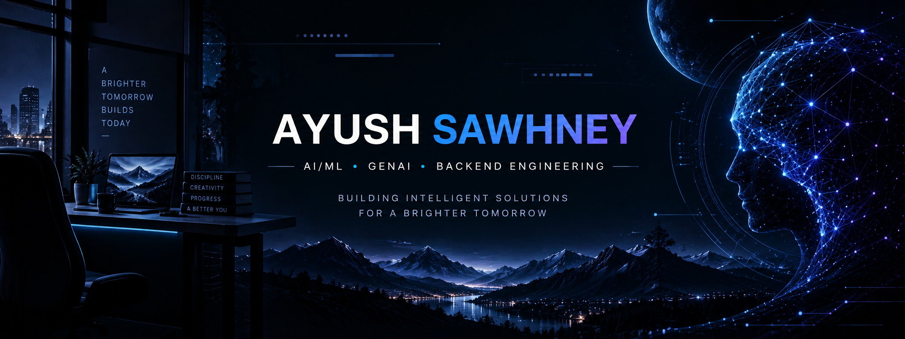

  

<h1 align="center">Hi 👋, I'm Ayush Sawhney</h1>

<h3 align="center">
Computer Science Engineer | AI/ML & Backend Developer
</h3>

---

## 🚀 About Me

🎓 **B.Tech Computer Science Engineering** student at Amity University, Noida (2024–2028)

💻 I enjoy building practical software systems at the intersection of **AI, Machine Learning, NLP, and backend development**.

🔭 Currently building and exploring:

- Artificial Intelligence & Machine Learning
- Generative AI & LLM applications
- Multi-Agent AI systems
- Natural Language Processing
- Backend & API Development
- Data Structures & Algorithms

💼 **Software Development Intern — Team Computers**

🎯 Interested in building reliable, production-oriented applications and continuously improving my engineering skills.

---

## 🛠️ Tech Stack

### Languages

### AI / ML / NLP

### Frameworks & Tools

---

## 🌟 Featured Projects

### 🤖 RecruitAI ATS

**AI-powered Applicant Tracking System** built as an end-to-end recruitment platform.

- Resume parsing and structured candidate information extraction
- NLP-based skill, education, experience and certification extraction
- Weighted job-description matching and candidate ranking
- Candidate application tracking and recruiter workflows
- Role-based authentication and admin controls
- Recruiter analytics dashboard
- REST API with FastAPI
- Dockerized and deployed on Render

**Stack:** Python · FastAPI · Streamlit · spaCy · SQLite · Pandas · Docker

🔗 **[Repository](https://github.com/Ayush06-coder/RecruitAI-ATS)**  
🌐 **[Live Demo](https://recruit-ai-owkl.onrender.com)**

---

### 🧠 Multi-Agent Hallucination Detector

A modular AI system designed to evaluate AI-generated answers using **independent verification agents and external web evidence**.

- Fact-checking against external evidence
- Internal consistency analysis
- Confidence scoring from 0–100
- Verdict aggregation across specialized agents
- `TRUE`, `FALSE`, and `UNCERTAIN` fact-check outcomes
- Automatic corrected-answer generation
- Entity, context, numerical and ambiguous-claim handling
- Gradio interface for interactive evaluation
- Automated pytest suite with **44 tests**

**Stack:** Python · LangChain · Groq · GPT-OSS 20B · DDGS · Gradio · pytest

🔗 **[Repository](https://github.com/Ayush06-coder/hallucination-detector)**  
🌐 **[Live Demo](https://hallucination-detector-q4wz.onrender.com)**

---

## 💼 Experience

### Software Development Intern — Team Computers

Worked in a professional software-development environment, gaining practical experience in development workflows, engineering practices, and building software beyond academic projects.

---

## 📚 Current Focus

- 🤖 AI / Machine Learning
- 🧠 Generative AI & LLM Applications
- 🔗 Multi-Agent Systems
- 🔍 NLP & Information Extraction
- ⚙️ Backend Development & REST APIs
- 🐳 Docker & Cloud Deployment
- 📐 Data Structures & Algorithms

---

## 🤝 Connect With Me

💼 **LinkedIn:**  
https://www.linkedin.com/in/ayush-sawhney-b8476a34b

🐙 **GitHub:**  
https://github.com/Ayush06-coder

---

### ⚡ Building. Learning. Improving.
